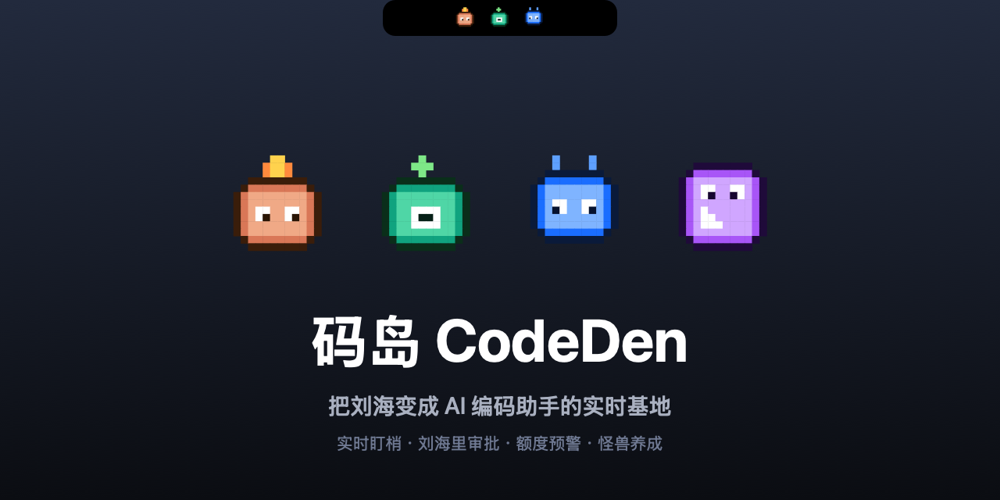

# 码岛 CodeDen 🏝



> 把 MacBook 刘海变成 AI 编码助手的实时基地——像素 RPG 风格。

你在用 Claude Code 这类 AI agent 跑任务时，常常得一直盯着终端：它跑到哪了？是不是在等我审批？
额度还剩多少？**码岛**把这些搬到刘海里——平时只是顶部一颗小药丸，需要你时果冻般展开。
每个 agent 是一只像素小怪兽，干得越多越会**升级进化**，把"看 AI 干活"变成一点点养成乐趣。

**核心功能**
- 👀 **实时盯梢**：刘海显示所有 agent 状态——在跑 / 需要你 / 完成 / 休息
- ✅ **不切终端就审批**：弹「允许 / 拒绝」直接回传给 Claude Code
- 📊 **额度一眼清**：顶栏看 5h / 7d 用量，快撞墙自动亮红 ▲
- 🎮 **怪兽养成**：完成 +20 / 批准 +5 / 工具 +2 经验，Lv.4 长星星、Lv.12 戴皇冠
- 🍮 果冻开合动画 + 芯片电音 + 一键接入 + 开机自启

> 仿 [Vibe Island](https://vibeisland.app) 的开源复刻 / 自用版。bundle id `app.codeden.macos`，
> 内部支持目录 `~/.notch-island/`。

收起态像灵动岛一样只提示「谁在跑 / 需要你 / 完成 / 休息」；hover 展开成
轻量列表，显示每个会话的项目·任务、你最后说的话、当前动作，顶部是各 agent
的 5h / 7d 额度。每只 agent 是一只会跳动的像素怪兽。

## 架构

```
Claude Code ──hooks──▶ bridge/notch-bridge.py ──追加──▶ ~/.notch-island/events.jsonl
                                                              │ 实时 tail (DispatchSource)
                                                              ▼
                                                       NotchIsland.app (Swift/SwiftUI)
                                                       刘海窗口 + 状态机渲染
额度： Claude statusLine .rate_limits ─▶ cache/rl.json ┐
       Codex OpenAI app-server 用量    ─▶ cache/*.json ┴▶ QuotaReader
```

- **App 只消费归一化事件**，所有「读 transcript、抽取你说的话」的智能都在 bridge 里 →
  App 简单、好调试，加新 agent 只需写新桥接，事件协议不变。
- 事件文件落在 `~/.notch-island/`，与已安装的 Vibe Island（`~/.vibe-island/`）完全隔离。

## 状态机

| Hook 事件 | 刘海状态 |
|---|---|
| `UserPromptSubmit` | 运行中（记下「你：…」） |
| `PreToolUse` / `PostToolUse` | 运行中（显示工具 + 参数） |
| `Notification`(权限) / `PermissionRequest` | **需要你**（审批）|
| `Notification`(空闲) | 空闲（等输入） |
| `Stop` | 完成（20s 后转空闲） |
| `SubagentStart/Stop` | 子 agent 计数（多只精灵） |
| `SessionEnd` | 移除 |

收起态聚合优先级：需要你 > 运行 > 完成 > 休息。额度 ≥90% 时刘海尾部亮红 ▲。

## 构建 & 运行

开发态：
```bash
cd NotchIsland
swift build
.build/debug/NotchIsland &        # 刘海出现在屏幕顶部，无 Dock 图标
```

打包成正式 .app（可日常使用）：
```bash
./build-app.sh                    # 生成 dist/NotchIsland.app（含桥接脚本，ad-hoc 签名）
open dist/NotchIsland.app
# 建议拖到 /Applications 后再开启「开机自启」更稳
```

无真实事件时 1.5s 后会载入演示数据，方便预览。

## 设置页

点刘海展开后右上角 ⚙ 打开。包含：
- **开机自启**（`SMAppService` 登录项，需正式 .app）
- **提示音** 开关
- **显示额度** 开关
- **需要审批时自动展开**
- **安装 / 卸载 Claude Code Hook**（一键，自动备份、不覆盖已有配置）
- 退出 App

偏好持久化在 UserDefaults。

## 安装 hook（接入真实 Claude Code）

```bash
python3 bridge/install.py          # 安全合并进 ~/.claude/settings.json，自动备份
```

- 只**追加**，不动你已有的任何 hook（含 Vibe Island）。
- 对正在进行的会话需重启生效；新会话自动生效。
- 卸载：`python3 bridge/uninstall.py`（只删带 `notch-bridge.py` 标记的项）。

测试桥接（不接 Claude）：
```bash
echo '{"hook_event_name":"PreToolUse","session_id":"t1","cwd":"'"$PWD"'","tool_name":"Bash","tool_input":{"command":"ls"}}' | python3 bridge/notch-bridge.py
cat ~/.notch-island/events.jsonl
```

## 额度数据

- **Codex**：读 `~/.notch-island/cache/usage-openai.json`，无则回退读 Vibe Island 的
  `~/.vibe-island/cache/usage-persist-openai.json`（本机已有，可直接显示真实数字）。
- **Claude 5h/7d**：来自 Claude Code statusLine stdin 的 `.rate_limits`。让它落盘需在
  statusLine 脚本里加一行把 `.rate_limits` 写到 `~/.notch-island/cache/rl.json`：
  ```bash
  echo "$input" | jq -c '.rate_limits // empty' > ~/.notch-island/cache/rl.json
  ```
  （Vibe Island 也是这么做的，需在其设置里开启 showUsage。）

## 审批回写（双向）

点刘海里的「允许/拒绝」即可把决定回传给 Claude Code，无需切回终端：

```
Claude 需要权限 ─PermissionRequest hook─▶ bridge 写带 request_id 的事件 + 阻塞轮询
                                              ▼
刘海弹出 允许/拒绝 ──点击──▶ App 写 decisions/<request_id>.json {"behavior":"allow"|"deny"}
                                              ▼
bridge 读到 → 输出 hookSpecificOutput.decision JSON → exit 0 → Claude 放行/拒绝
```

- 兜底：App 未运行或超时（默认 1h）→ bridge 立即放行回退到终端原生提示，绝不挂死 Claude。
- `install.py` 给 PermissionRequest 配 `timeout: 86400`，允许长时间等你点击。
- App 启动写 `~/.notch-island/run/app.pid`，bridge 用它判断 App 是否在跑。

## 现状 / 待办

- ✅ 刘海窗口（果冻弹簧动画）、收起态穷举、展开列表、像素怪兽、芯片电音
- ✅ 事件实时链路、额度读取
- ✅ **审批回写**（允许/拒绝双向，含 App 不在的兜底）
- ✅ 打包成 .app（LSUIElement）+ 开机自启（SMAppService）+ 设置页（含一键装/卸 Hook）
- ✅ 像素 App 图标（make-icon.swift → AppIcon.icns）+ 改名「码岛 CodeDen」
- ✅ 养成系统：怪兽升级/进化/伙伴图鉴（持久化 UserDefaults）
- ⏳ 多 agent 桥接（Codex/Gemini/Cursor 各自的 hook/日志接入）
- ⏳ 终端 Jump（按 cwd + AppleScript 跳回对应终端 tab）
- ⏳ AskUserQuestion 选项回写（提问的数字选项点选回传）
- ⏳ 公证发布（dist-notarize.sh，需你的 Developer ID）
